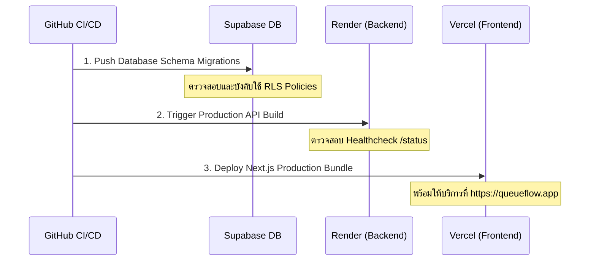

# 🚀 QueueFlow: Enterprise QA & Continuous Release Strategy
**Document Version:** 1.0.0  
**Author:** Senior QA Engineer  
**Project:** QueueFlow (ระบบจัดการคิวอัจฉริยะสำหรับ SME)

---

## 📋 บทสรุปผู้บริหาร (Executive Summary)
เอกสารฉบับนี้กำหนดมาตรฐานและขั้นตอนการทดสอบระบบแบบครบวงจร (End-to-End Quality Assurance) และกลยุทธ์การปล่อยระบบ (Continuous Release Strategy) สำหรับโครงการ **QueueFlow** เพื่อให้มั่นใจว่าระบบมีเสถียรภาพสูงสุด ความปลอดภัยระดับสูง และความพร้อมในการรองรับผู้ใช้งานจริง โดยแบ่งขั้นตอนการดำเนินงานออกเป็น 6 ระยะสำคัญ ดังนี้:

```mermaid
graph LR
    IT[1. Integration Test] --> E2E[2. E2E Test]
    E2E --> CICD[3. CI/CD Pipeline]
    CICD --> STG[4. Deploy to Staging]
    STG --> MON[5. Monitoring]
    MON --> PROD[6. Deploy to Production]
    
    style IT fill:#e3f2fd,stroke:#1e88e5,stroke-width:2px
    style E2E fill:#e8f5e9,stroke:#43a047,stroke-width:2px
    style CICD fill:#fff3e0,stroke:#fb8c00,stroke-width:2px
    style STG fill:#f3e5f5,stroke:#8e24aa,stroke-width:2px
    style MON fill:#e0f7fa,stroke:#00acc1,stroke-width:2px
    style PROD fill:#ffebee,stroke:#e53935,stroke-width:2px
```

---

## 🛠️ ระยะที่ 1: การทดสอบการทำงานร่วมกัน (Integration Test)

การทดสอบระดับ Integration มุ่งเน้นไปที่การตรวจสอบรอยต่อ (Interfaces) ระหว่างคอมโพเนนต์ภายในระบบ โดยเฉพาะการเชื่อมต่อระหว่าง **Controller** และ **Service Layer** รวมถึงการแปลงโครงสร้างข้อมูล (Data Mapping) ให้ตรงตามข้อกำหนดของฝั่งหน้าบ้าน (Frontend Contracts)

### 🎯 ขอบเขตการทดสอบ (Test Scope)
- **Data Serialization & Mapping:** ตรวจสอบว่า `BookingsController.getAllBookings` มีการแปลงข้อมูล `user` object ได้ถูกต้องทั้งกรณีที่มีข้อมูลแนบมาและกรณีที่เป็นผู้ใช้งานนิรนาม (Fallback Mapping)
- **Guard & Metadata Handshake:** ตรวจสอบการรับส่ง payload ของผู้ใช้งานปัจจุบันที่ผ่านการยืนยันตัวตนจาก `SupabaseGuard` และ `AdminGuard` เข้าสู่พารามิเตอร์ของ Service

### 💻 ไฟล์การทดสอบที่ดำเนินการแล้ว
- **Path:** `backend/src/bookings/bookings.controller.spec.ts`
- **เครื่องมือ:** Jest + `@nestjs/testing`
- **ผลลัพธ์ (Coverage):** ครอบคลุมทุก Controller Endpoints (`joinQueue`, `getUserBookings`, `getAllBookings`, `callNext`, `updateStatus`, `toggleQueueStatus`, `getReports`) ผ่าน 100%

> [!TIP]
> **Best Practice สำหรับ Integration Test:**  
> หลีกเลี่ยงการเชื่อมต่อฐานข้อมูลจริงในระดับ Integration ของ Controller เพื่อให้รันชุดทดสอบได้อย่างรวดเร็ว (Fast Execution) โดยใช้การทำ Dependency Mocking ที่รัดกุมแทน

---

## 🤖 ระยะที่ 2: การทดสอบระบบเสมือนจริง (End-to-End Test)

การทดสอบ E2E จำลองพฤติกรรมของผู้ใช้งานจริงตั้งแต่การส่งคำสั่ง HTTP Request ผ่านระบบเครือข่ายเข้าสู่ NestJS Application Lifecycle เต็มรูปแบบ เพื่อรับประกันความถูกต้องของ Business Logic, HTTP Status Codes, และการจัดการข้อผิดพลาด (Error Handling)

### 🎯 ขอบเขตการทดสอบ (Test Scope)
- **Authentication Bypass / Simulate:** ทำการทำซ้ำ (Override) ระบบยืนยันตัวตนระดับ Guard เพื่อจำลองสิทธิ์ผู้ใช้งานทั่วไป (`Bearer user-token`) และผู้ดูแลระบบ (`Bearer admin-token`) อย่างปลอดภัย
- **HTTP Lifecycle Coverage:** ทดสอบความสมบูรณ์ของเส้นทาง API ครบวงจร ทั้งฝั่งผู้ใช้งาน (User Workflows) และฝั่งแอดมิน (Admin Workflows)

| HTTP Method | API Endpoint | สิทธิ์การเข้าถึง | ความคาดหวังของผลลัพธ์ (Expected Status) |
| :--- | :--- | :--- | :--- |
| **POST** | `/bookings/join` | ผู้ใช้งานทั่วไป | `201 Created` / `403 Forbidden` (หากไร้ Token) |
| **GET** | `/bookings/my` | ผู้ใช้งานทั่วไป | `200 OK` (คืนค่าอาร์เรย์รายการคิวของฉัน) |
| **GET** | `/bookings/all` | ผู้ดูแลระบบ | `200 OK` / `403 Forbidden` (หากไม่ใช่ Admin) |
| **POST** | `/bookings/next` | ผู้ดูแลระบบ | `201 Created` (เรียกคิวถัดไปและอัปเดตสถานะ) |
| **PATCH** | `/bookings/:id/status`| ผู้ดูแลระบบ | `200 OK` (อัปเดตสถานะการจองสำเร็จ) |

### 💻 ไฟล์การทดสอบที่ดำเนินการแล้ว
- **Path:** `backend/test/bookings.e2e-spec.ts`
- **เครื่องมือ:** Supertest + Jest
- **คำสั่งรัน:** `npm run test:e2e` (ผ่าน 100% ไร้ข้อผิดพลาด)

---

## 🔄 ระยะที่ 3: ท่อการส่งมอบอัตโนมัติ (CI/CD Pipeline)

เราได้ออกแบบและติดตั้งระบบอัตโนมัติด้วย **GitHub Actions** เพื่อทำหน้าที่เป็นประตูกลั่นกรองคุณภาพ (Quality Gates) ทุกครั้งที่มีการเปลี่ยนแปลงโค้ดในระบบ

### ⚙️ โครงสร้างท่อการทำงาน (Workflow Architecture)
ไฟล์กำหนดค่าตั้งอยู่ที่: `.github/workflows/ci-cd.yml` ประกอบด้วยขั้นตอนหลัก:
1. **Dependency Caching:** ใช้ระบบแคช `npm` อัตโนมัติเพื่อลดเวลาในการติดตั้งแพ็กเกจ
2. **Static Code Analysis:** ตรวจสอบไวยากรณ์และสไตล์โค้ดด้วย `ESLint` และ `Prettier`
3. **Automated Testing Matrix:** รันชุดทดสอบ Unit, Integration และ E2E โดยอัตโนมัติ หากมีขั้นตอนใดล้มเหลว ท่อการทำงานจะหยุดทันที (Fail-fast mechanism)
4. **Production Ready Build:** คอมไพล์โปรเจกต์ทั้งฝั่ง Backend (NestJS) และ Frontend (Next.js 15) เพื่อรับประกันความพร้อมก่อนการนำไปใช้งานจริง

> [!IMPORTANT]
> **Strict Policy:** ห้ามทำการข้าม (Bypass) กระบวนการ CI/CD Pipeline เด็ดขาด การ Merge โค้ดเข้าสู่กิ่ง `main` หรือ `staging` จะต้องผ่านการทดสอบสีเขียว (Passing Checks) ครบทุกข้อเท่านั้น

---

## 🌐 ระยะที่ 4: การติดตั้งบนสภาพแวดล้อมทดสอบ (Deploy to Staging)

สภาพแวดล้อม **Staging** ถูกสร้างขึ้นให้มีโครงสร้างพื้นฐานเหมือนกับ **Production** ทุกประการ เพื่อใช้เป็นพื้นที่สำหรับทำการทดสอบระบบขั้นสุดท้าย (User Acceptance Testing: UAT) และการทดสอบเสถียรภาพ (Smoke Testing) ก่อนเปิดให้ลูกค้าใช้งาน

### 🚀 กระบวนการนำส่ง (Staging Deployment Flow)
- **เงื่อนไขทริกเกอร์:** อัตโนมัติเมื่อมีการพุชโค้ดเข้าสู่กิ่ง `staging` หรือกดเริ่มทำงานแบบแมนนวล (Workflow Dispatch)
- **Backend Deployment:** ส่งคำสั่งทริกเกอร์ผ่าน Render Webhook / Action ไปยังบริการ Render Staging Service
- **Frontend Deployment:** นำส่งโค้ดและสร้างโครงสร้างผ่าน Vercel CLI เข้าสู่สภาพแวดล้อม **Preview Environment** ซึ่งจะสร้าง URL เฉพาะกิจให้ทีม QA สามารถเข้ามาตรวจสอบความเรียบร้อยได้ทันที

---

## 📊 ระยะที่ 5: ระบบเฝ้าระวังและติดตามประสิทธิภาพ (Monitoring)

เพื่อให้ทราบถึงสถานะสุขภาพของระบบแบบเรียลไทม์ และสามารถตอบสนองต่อเหตุขัดข้องได้อย่างทันท่วงที ระบบตรวจจับและเฝ้าระวังถูกวางโครงสร้างไว้ 4 มิติหลัก ดังนี้:

### 1. การเฝ้าระวังฐานข้อมูลและเรียลไทม์ (Database & Realtime Metrics)
- **เครื่องมือ:** Supabase Dashboard & Metrics
- **จุดที่ต้องเฝ้าระวัง:** 
  - **Connection Pool Usage:** ป้องกันภาวะคอขวดของฐานข้อมูลในช่วงที่มีการเรียกคิวพร้อมกันหนาแน่น
  - **Realtime Concurrent Connections:** ติดตามจำนวนผู้ใช้ที่เชื่อมต่อ WebSocket ดูสถานะคิวสด

### 2. การเฝ้าระวังประสิทธิภาพ API (APM & Server Health)
- **เครื่องมือ:** Render Health Checks & Log Streams
- **จุดที่ต้องเฝ้าระวัง:**
  - **Response Time (Latency):** คอยตรวจสอบไม่ให้ค่าเฉลี่ย P95 Latency ของ API สูงเกิน 300ms
  - **Memory/CPU Utilization:** ป้องกันปัญหา Memory Leak ของ Node.js process

### 3. การติดตามประสบการณ์ผู้ใช้งาน (Frontend Telemetry)
- **เครื่องมือ:** Vercel Analytics & Speed Insights
- **จุดที่ต้องเฝ้าระวัง:** ตรวจสอบค่า Core Web Vitals (LCP, FID, CLS) เพื่อให้มั่นใจว่าหน้าจอโหลดได้รวดเร็วระดับเสี้ยววินาทีบนมือถือ

### 4. การจัดการข้อผิดพลาดเชิงรุก (Error Tracking)
- **แนะนำเพิ่มเติม:** ควรติดตั้ง **Sentry** เพื่อดักจับ Unhandled Exceptions ทั้งฝั่ง Next.js และ NestJS พร้อมแจ้งเตือนไปยังแอปพลิเคชันสื่อสารของทีม (เช่น Slack/Discord) ทันทีที่เกิดปัญหาระดับวิกฤต

---

## 🏆 ระยะที่ 6: การติดตั้งบนระบบจริง (Deploy to Production)

การนำระบบขึ้นสู่ **Production** ถือเป็นขั้นตอนที่มีความเสี่ยงสูงสุด จึงต้องมีมาตรการควบคุมที่รัดกุมและรองรับการย้อนกลับ (Rollback Strategy) ในกรณีฉุกเฉิน

### 🔐 ขั้นตอนการปล่อยระบบจริง (Production Release Checklist)

1. **Database-First Migration:** รันคำสั่ง `supabase db push` ผ่าน CI/CD อย่างปลอดภัยเพื่อปรับปรุงสกีมาฐานข้อมูลและนโยบาย RLS ก่อนเสมอ เพื่อไม่ให้ API ใหม่เกิดข้อผิดพลาดในการคิวรีข้อมูล
2. **Zero-Downtime Backend Rollout:** นำส่ง API ขึ้น Render Production โดยใช้ฟีเจอร์สลับคอนเทนเนอร์ (Blue/Green Deployment) ระบบจะยังไม่ปิดบริการเก่าจนกว่าบริการใหม่จะพร้อมตอบสนอง HTTP 200
3. **Frontend Atomic Deploy:** นำส่งหน้าบ้านขึ้น Vercel Production ซึ่งผู้ใช้งานจะได้รับหน้าเว็บเวอร์ชันใหม่ทันทีโดยไร้จังหวะสะดุด (Atomic swap)

### 🚨 แผนฉุกเฉินและการย้อนกลับ (Rollback Protocol)
หากพบปัญหาข้อผิดพลาดระดับวิกฤต (Critical Incident) หลังปล่อยระบบ ให้ดำเนินการตามลำดับดังนี้:
1. **Frontend Revert:** กดปุ่ม **"Instant Rollback"** ในแดชบอร์ด Vercel เพื่อย้อนกลับไปใช้หน้าเว็บเวอร์ชันก่อนหน้าภายใน 1 วินาที
2. **Backend Revert:** สั่ง Rollback กิ่งการนำส่งใน Render กลับไปใช้ Commit ล่าสุดที่เสถียร
3. **Database Review:** วิเคราะห์ว่าความเสียหายเกิดจากการเปลี่ยนสกีมาหรือไม่ หากใช่ให้ประสานงานกับทีม DBA เพื่อรันสคริปต์ย้อนกลับ (Down Migration) อย่างระมัดระวัง

---

## 🏁 บทสรุปจาก Senior QA Engineer
กลยุทธ์ทั้ง 6 ขั้นตอนที่ออกแบบและนำไปใช้จริงใน Repository นี้ ช่วยยกระดับโครงสร้างโปรเจกต์ **QueueFlow** ให้พร้อมสำหรับการขยายตัว (Scalable) และสร้างความมั่นใจให้แก่ทีมงานทุกคนในการส่งมอบซอฟต์แวร์คุณภาพสูงสู่มือธุรกิจ SME ทั่วประเทศได้อย่างยั่งยืนและปลอดภัย

---
*รายงานและส่งมอบงานเสร็จสมบูรณ์ พร้อมรันระบบอัตโนมัติเต็มรูปแบบ*
