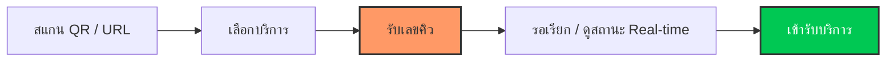
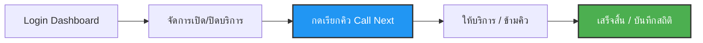

# QueueFlow - ระบบจัดการคิวอัจฉริยะระดับพรีเมียมสำหรับ SME

QueueFlow เป็นระบบจัดการคิวแบบ Real-time ที่ออกแบบมาเพื่อธุรกิจยุคใหม่ ช่วยให้การจัดการลูกค้าเป็นเรื่องง่าย รวดเร็ว และมอบประสบการณ์ที่ดีเยี่ยมให้กับทั้งลูกค้าและผู้ดูแลระบบ ด้วยความล่าช้า (Latency) ระดับเสี้ยววินาทีและดีไซน์ที่สวยงาม

## 🚀 คุณสมบัติเด่น (Features)

- **อัปเดตแบบ Real-time:** ทราบสถานะคิวได้ทันทีโดยไม่ต้องรีเฟรชหน้าจอ ด้วยเทคโนโลยี Supabase Realtime
- **รองรับหลายภาษา:** ใช้งานได้ทั้งภาษาไทยและภาษาอังกฤษอย่างสมบูรณ์ (Full Localization)
- **แดชบอร์ดอัจฉริยะ:** หน้าจอสำหรับผู้ดูแลระบบที่จัดการง่าย เรียกคิวได้รวดเร็ว และมีสถิติที่ชัดเจน
- **ดีไซน์ระดับพรีเมียม:** อินเตอร์เฟซสวยงาม ใช้งานลื่นไหล ตอบสนองทุกอุปกรณ์ (Framer Motion + Tailwind CSS)
- **ความปลอดภัยสูง:** ปกป้องข้อมูลด้วย Row Level Security (RLS) และระบบ Authentication ที่รัดกุม

---

## 🔄 ขั้นตอนการทำงาน (Workflow)

### 👤 สำหรับผู้ใช้งาน (User Workflow)

1.  **การเข้าถึง (Access):** ลูกค้าสแกน QR Code ที่หน้าร้านหรือเข้าผ่าน URL เพื่อเข้าสู่หน้าจองคิว
2.  **เลือกบริการ (Select Service):** เลือกประเภทบริการที่ต้องการ (เช่น ปรึกษาทั่วไป, รับสินค้า, หรือบริการเฉพาะทาง)
3.  **รับคิว (Get Ticket):** ระบบจะออกเลขคิว พร้อมแสดงจำนวนคิวที่รอก่อนหน้าและเวลาที่คาดว่าจะรอ
4.  **ติดตามสถานะ (Live Tracking):** ลูกค้าสามารถดูสถานะคิวปัจจุบันที่กำลังถูกเรียกได้แบบ Real-time ผ่านมือถือของตนเอง
5.  **รับบริการ (Service):** เมื่อถึงคิว หน้าจอจะแจ้งเตือนให้ลูกค้าติดต่อเคาน์เตอร์เพื่อรับบริการ



### ⚙️ สำหรับผู้ดูแลระบบ (Admin Workflow)

1.  **การเข้าใช้งาน (Login):** แอดมินเข้าสู่ระบบผ่านหน้า Admin Dashboard เพื่อความปลอดภัย
2.  **จัดการสถานะร้าน (Management):** สามารถเปิด/ปิด การรับคิวของแต่ละแผนกหรือบริการได้ตามความหนาแน่นของลูกค้า
3.  **เรียกคิว (Call Queue):** เมื่อเจ้าหน้าที่พร้อม แอดมินกดปุ่ม **"เรียกคิวถัดไป" (Call Next)** เพื่อเรียกคิวจากรายการที่รออยู่
4.  **จัดการลูกค้า (Queue Control):** สามารถข้ามคิว (Skip), เรียกซ้ำ (Recall) หรือกดยืนยันการให้บริการเสร็จสิ้น (Complete)
5.  **ตรวจสอบสถิติ (Analytics):** ดูรายงานจำนวนคิวรวมในแต่ละวัน และประสิทธิภาพในการให้บริการ



---

## 🛠️ เทคโนโลยีที่ใช้ (Tech Stack)

- **Frontend:** [Next.js 15](https://nextjs.org/) (React, Tailwind CSS, Framer Motion)
- **Backend:** [NestJS](https://nestjs.com/) (Node.js, Prisma ORM)
- **Database & Realtime:** [Supabase](https://supabase.com/) (PostgreSQL, Auth, Realtime)
- **Infrastructure:** Vercel (Frontend) & Render (Backend)

## 📁 โครงสร้างโปรเจกต์ (Project Structure)

```text
QueueFlow/
├── frontend/    # แอปพลิเคชัน Next.js (หน้าบ้านและแดชบอร์ด)
├── backend/     # ระบบ API และ Business Logic ด้วย NestJS
└── database/    # โครงสร้างฐานข้อมูล SQL และนโยบายความปลอดภัย (RLS)
```

---
© QueueFlow - ระบบจัดการคิวเพื่อธุรกิจ SME ทั่วไทย

